<!--
  =====================================================
  Sathya's GitHub Profile
  Auto-updated daily via GitHub Actions
  Content between PROFILE markers is auto-generated.
  You may freely edit content outside of markers.
  =====================================================
-->

<!-- PROFILE:HERO:START -->

  

<!-- PROFILE:HERO:END -->

<!-- PROFILE:ABOUT:START -->

  

<!-- PROFILE:ABOUT:END -->

<!-- PROFILE:TECHSTACK:START -->

  

<!-- PROFILE:TECHSTACK:END -->

<!-- PROFILE:STATS:START -->

  

<!-- PROFILE:STATS:END -->

<!-- PROFILE:CONTRIBUTIONS:START -->

  

<!-- PROFILE:CONTRIBUTIONS:END -->

<!-- PROFILE:REPOS:START -->

<h3>Featured Repositories</h3>

<!-- PROFILE:REPOS:END -->

<!-- PROFILE:CONNECT:START -->

<h3>Connect</h3>

<a href="https://github.com/SathyaMaragani"><strong>GitHub</strong></a>

<!-- PROFILE:CONNECT:END -->

<!-- PROFILE:FOOTER:START -->

  

<!-- PROFILE:FOOTER:END -->
